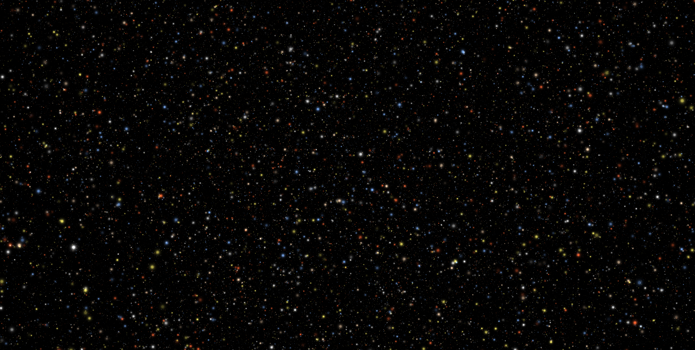

# 🌌 deepfield.js

**A high-performance, zero-dependency Monte Carlo sampling library for 1D, 2D, and 3D geometries with uniform distribution guarantees.**



> **Why Deep Field?**
> Just as the Hubble telescope revealed thousands of galaxies in a tiny, seemingly empty patch of sky, `deepfield.js` reveals complex volumes through the accumulation of millions of discrete points.
---

## 🚀 Performance
`deepfield.js` is optimized for real-time graphics and procedural generation. 

* **Fast:** Benchmarked at **~2.4M samples/sec** for complex CSG Composite Shapes (Union/Difference) on standard mobile hardware (Thinkpad T14).
* **Memory Efficient:** Designed to fill `Float32Array` buffers for direct WebGL/REGL integration.
* **Zero Dependencies:** Pure mathematical implementation.

---

## ✨ Features

* **1D Paths:** Uniform Arc-Length sampling for Lines, Arcs, and Bezier curves (no "speed-up" on curves).
* **2D Shapes:** Circles, Ellipses, Rectangles, Triangles, and Convex Polygons.
* **3D Volumes:** Spheres, Ellipsoids, Boxes, Cones, and Cylinders.
* **CSG (Boolean) Operations:** Create complex geometry using `Union`, `Intersection`, and `Difference` with uniform density across overlaps.

---

## 🛠 Quick Start

```javascript
import { Sphere3D, Cylinder3D, CompositeShape } from 'deepfield.js';

// 1. Create a complex shape (A Sphere with a Hole)
const base = new Sphere3D({ x: 0, y: 0, z: 5 }, 5);
const hole = new Cylinder3D({ x: 0, y: 0, z: 0 }, 2, 10);

const hollowSphere = new CompositeShape('difference', [base, hole]);

// 2. Generate 1 million points for a WebGL Buffer
const iterations = 1000000;
const buffer = new Float32Array(iterations * 3);

for (let i = 0; i < iterations; i++) {
  const p = hollowSphere.sample();
  buffer[i * 3]     = p.x;
  buffer[i * 3 + 1] = p.y;
  buffer[i * 3 + 2] = p.z;
}
```
## 🧪 Mathematical Rigor

We use the "Gold Standard" for uniform distribution:

- **2D:** Square-root distribution for radial sampling to prevent center-clumping.

- **3D:** Cube-root distribution for volumes and `acos` mapping for spherical coordinates to prevent polar-clumping.

- **CSG:** Rejection sampling for Unions to ensure overlapping regions don't become "brighter" or denser than the rest of the shape.

## 🤝 Contributing

We are currently building out **Deterministic Sampling** (`sample(t)`) for path animation. Check out [Issue #1](https://github.com/tsogtb/deep-field/issues/1) to help out!

## 📜 License

MIT © Tsogt Baigalmaa


